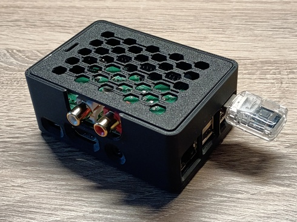

## RadioPlayer

A minimal application to play internet radio streams.

The RadioPlayer application reads internet radio stream URL's from a text file and plays them using the commandline 'mpg123' (mpeg) or 'ffplay' audio player. Stream playback is controlled via an IR remote by reading keyevents from an HID input device.

The application was created on a Raspberry Pi 3 running Raspbian GNU/Linux 11 (bullseye), mounted with a HiFiBerry DAC+. IR remote control button events are read from a FLIRC USB Universal Remote Control Receiver device.



### 1. Flirc Setup
If using a Flirc USB receiver, first setup the IR remote control button key-mapping:
https://docs.flirc.io/flirc-usb/

For Debian the Flirc cmdline tools can be downloaded from (use armhf arch):
http://apt.flirc.tv/arch/

To control playback, the application uses the IR remote control buttons 1-9 (play streams 0-8), 0 (stop playback), arrow-left (play previous stream) and arrow-right (play next stream). These buttons are mapped to different keycodes which are read from the USB HID input device.

### 2. Testing the USB Universal Remote Control Receiver

After the remote control key-mapping has been setup, test key event reception with the read_keyevent application.

Compile the file:
```
gcc -Wall -Wextra -o read_keyevent read_keyevent.c
```

Example usage:
```
read_keyevent /dev/input/event0
```

### 3.Audio Players
#### 3.1 mpg123
For stream playback the (MP3) audio player 'mpg123' is used by default. Project details can be found here: https://mpg123.org

#### 3.2 ffplay
If desired an alternative audio player 'ffplay' can be configured. This player has the advantage that is able to playback many more audio formats next to MP3, like for example AAC, which is also often used as an audio streaming format. Project details can be found here: https://ffmpeg.org/about.html

### 4. Search for Internet Radio Streams
There are many databases tracking internet radio streams. One of the larger and well known ones is: https://fmstream.org

After copying an audio stream URL, you can test it from the commandline in either of the following ways, depending on the player chosen:
```
curl -s <audio stream URL> | mpg123 -
```
```
curl -s <audio stream URL> | ffplay -nodisp -autoexit -
```
The list of audio streams can be added to a regular text file, using one audio stream URL per line. Only valid http:// and https:// URL's will be read by the application during startup.

### 5. Compiling the RadioPlayer
Default compilation is as follows:
```
g++ -Wall -Wextra -O2 radioplayer.cpp -o radioplayer
```

To use 'ffplay' as player use:

```
g++ -Wall -Wextra -O2 -DAUDIO_PLAYER=\"ffplay\" radioplayer.cpp -o radioplayer
```

Running the application:
```
radioplayer <event input device> <path to audio streams file>
```
### 6. Run the RadioPlayer using 'screen' (in detached-mode)
For most practical usecases the player will need to be run in the background. This can be acchieved by running the application using 'screen' in detached mode (for more options see 'man screen'). For example like:

```
screen -d -m /home/guest/radioplayer /dev/input/event0 /home/guest/radiostreams.txt
```

